# 🏛️ C.O.R.E. Video Intelligence — Complete Architecture

> **Project:** Surat City Video Surveillance & Person Tracking System  
> **Codename:** C.O.R.E. (Central Operations & Reconnaissance Engine)  
> **Stack:** Python · FastAPI · React · InsightFace · Milvus · PostgreSQL · Redis · WebRTC · Docker

---

## 📐 High-Level System Architecture

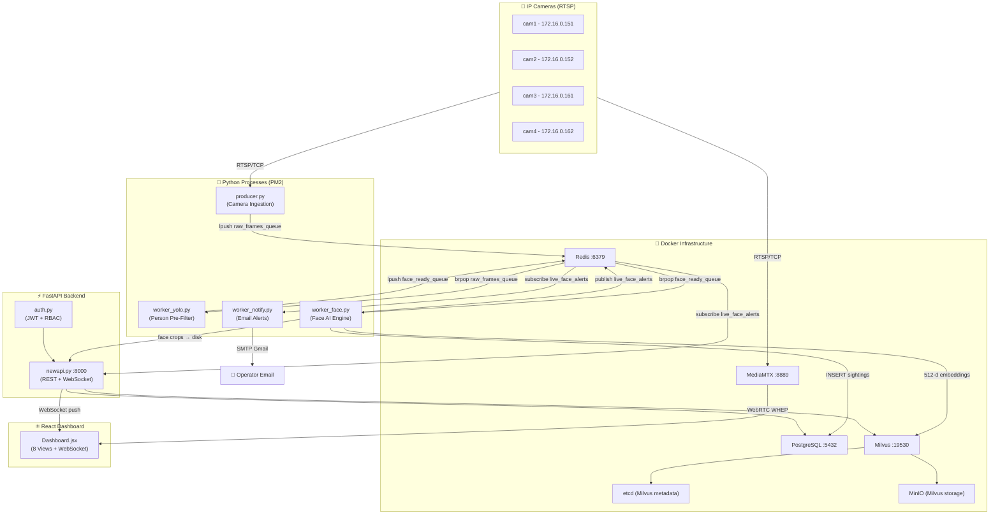

---

## 🐳 Layer 1: Docker Infrastructure

**File:** [docker-compose.yml](file:///c:/Users/Hp/Desktop/video_intelligence_2/docker-compose.yml)

6 containers orchestrated via Docker Compose:

| Container | Image | Port | Role |
|---|---|---|---|
| `milvus-standalone` | `milvusdb/milvus:v2.3.0` | 19530 | Vector database — stores 512-dimensional face embeddings for similarity search |
| `milvus-etcd` | `coreos/etcd:v3.5.0` | — | Milvus metadata store (cluster coordination) |
| `milvus-minio` | `minio/minio` | 9000, 9001 | Milvus blob storage backend (segment files) |
| `core_redis` | `redis:latest` | 6379 | Message queue (frame pipeline) + cache (dedup/cooldowns) + pub/sub (alerts) |
| `core_postgres` | `postgres:15` | 5432 | Relational DB — sightings, subjects, watchlists, users, cameras, settings |
| `core_mediamtx` | `bluenviron/mediamtx` | 8889, 8554, 8189/udp | RTSP→WebRTC bridge for zero-latency live video in browser |

**Persistent Volumes:** `etcd_data`, `minio_data`, `postgres_data`

> [!IMPORTANT]
> MediaMTX is configured via [mediamtx.yml](file:///c:/Users/Hp/Desktop/video_intelligence_2/mediamtx.yml) with 4 hardcoded RTSP camera paths. It converts RTSP streams to WebRTC using the WHEP protocol, allowing the React frontend to display sub-100ms latency video without any Python intermediary.

---

## 🗄️ Layer 2: Database Schema

### File: [database_init/init_db.py](file:///c:/Users/Hp/Desktop/video_intelligence_2/database_init/init_db.py)

### PostgreSQL Tables (7 tables)

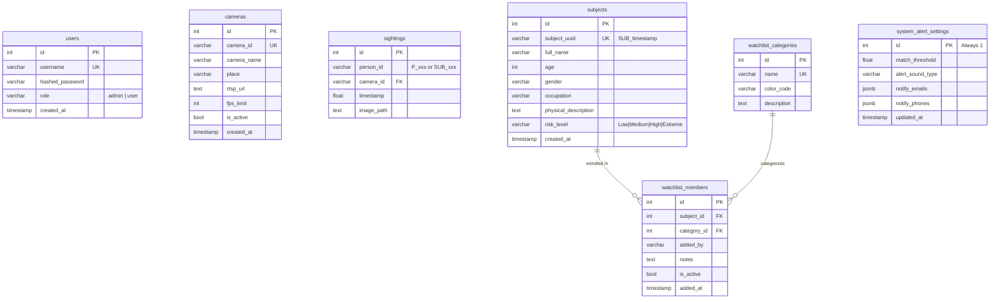

**Default watchlist categories** (seeded on init): Blacklist (🔴), Most Wanted (🟠), Missing Person (🔵), VIP (🟣)

### Milvus Vector Collections (2 collections)

| Collection | Fields | Index | Purpose |
|---|---|---|---|
| `face_embeddings` | `id` (auto INT64), `person_id` (VARCHAR), `embedding` (512-d FLOAT_VECTOR) | IVF_FLAT, COSINE, nlist=128 | All detected civilian face embeddings |
| `watchlist_faces` | `id` (auto INT64), `watchlist_id` (VARCHAR), `embedding` (512-d FLOAT_VECTOR) | IVF_FLAT, COSINE, nlist=128 | Enrolled suspect face embeddings |

> [!NOTE]
> Milvus COSINE distance: `0.0` = identical faces, `1.0` = completely different. A match requires distance **below** the threshold (default `0.35` ≈ 65% similarity).

---

## 🎥 Layer 3: Camera Ingestion

### Live RTSP Pipeline

**File:** [ingestion/producer.py](file:///c:/Users/Hp/Desktop/video_intelligence_2/ingestion/producer.py)

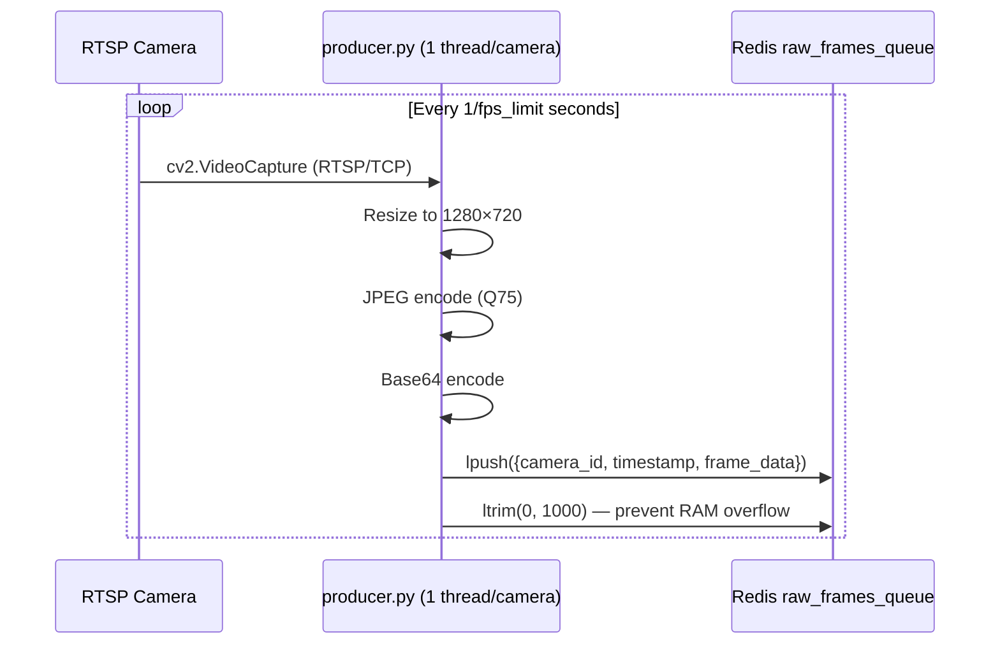

**Key Design Decisions:**
- **1 thread per camera** via `CameraProducer(threading.Thread)` — each thread runs independently
- **Dynamic camera sync** — polls PostgreSQL `cameras` table every 5 seconds, auto-starts new cameras, stops removed ones, restarts on config changes ([producer.py:107-146](file:///c:/Users/Hp/Desktop/video_intelligence_2/ingestion/producer.py#L107-L146))
- **RTSP/TCP transport** — `os.environ["OPENCV_FFMPEG_CAPTURE_OPTIONS"] = "rtsp_transport;tcp"` prevents UDP packet loss
- **Buffer size = 2** — `cap.set(cv2.CAP_PROP_BUFFERSIZE, 2)` ensures only the freshest frame is read
- **Auto-reconnect** — if `cap.read()` fails, waits 5s and reconnects

### Offline Video Pipeline

**File:** [ingestion/producer_folder.py](file:///c:/Users/Hp/Desktop/video_intelligence_2/ingestion/producer_folder.py)

- Scans a folder for `.mp4/.avi/.mkv/.mov` files
- 1 thread per video file
- Frame skip: `frames_to_skip = max(1, int(video_fps × process_every_n_seconds))`
- Camera ID = filename truncated to 45 chars (Postgres VARCHAR(50) safety)
- Also pushes MJPEG frames to Redis for web preview (`latest_frame_{camera_id}`)

---

## 🧠 Layer 4: AI Worker Pipeline

The heart of the system. Three workers form a sequential pipeline:

```
raw_frames_queue ──→ [YOLO Pre-Filter] ──→ face_ready_queue ──→ [Face Worker] ──→ Milvus/PG/WS
```

### Stage 1: YOLO Pre-Filter

**File:** [ai_worker/worker_yolo.py](file:///c:/Users/Hp/Desktop/video_intelligence_2/ai_worker/worker_yolo.py)

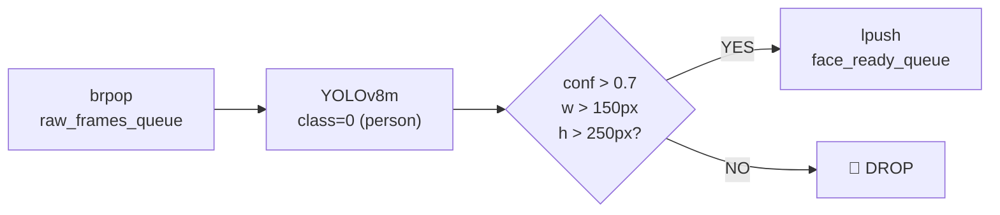

- **Model:** YOLOv8 Medium (`yolov8m.pt`, 52MB)
- **Purpose:** Saves ~60-80% GPU compute by discarding frames with no detectable people
- **Queue cap:** `ltrim(face_ready_queue, 0, 500)` — prevents face worker backlog
- **Metrics:** Tracks `frames_passed` and `frames_rejected` per session

### Stage 2: Face Detection, Recognition & Matching

**File:** [ai_worker/worker_face.py](file:///c:/Users/Hp/Desktop/video_intelligence_2/ai_worker/worker_face.py) — **374 lines, the main production worker**

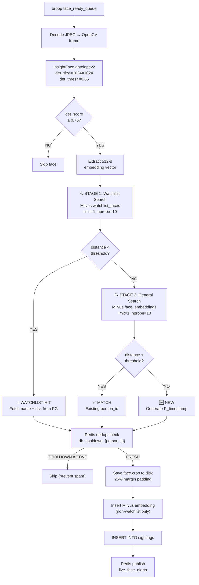

**AI Model Configuration:**
```python
face_app = FaceAnalysis(name='antelopev2', providers=['CUDAExecutionProvider', 'CPUExecutionProvider'])
face_app.prepare(ctx_id=0, det_thresh=0.65, det_size=(1024, 1024))
```
- **antelopev2** = RetinaFace (detection) + ArcFace (recognition), bundled by InsightFace
- Produces **512-dimensional float vectors** per face
- `det_size=(1024, 1024)` — input size for the detection model (larger = more accurate, slower)

**Dynamic Threshold System:**
```python
# Fetched from Redis on every frame — UI slider writes to this key
raw_thresh = r.get("GLOBAL_MATCH_THRESHOLD")
CURRENT_MATCH_THRESHOLD = float(raw_thresh) if raw_thresh else 0.35
```

**Dual Anti-Spam Cooldown System** ([worker_face.py:242-265](file:///c:/Users/Hp/Desktop/video_intelligence_2/ai_worker/worker_face.py#L242-L265)):
1. **DB Cooldown** (`db_cooldown_{person_id}`, 60s) — prevents writing the same face to DB 30 times/second. Always active.
2. **Alert Cooldown** (`alert_cooldown_{person_id}`, 60s) — prevents WebSocket alert spam. Only set when system is **Armed**. When **Disarmed**, alert locks are NOT set, so the first frame after re-arming triggers immediately.

**Face Crop Margin** ([worker_face.py:138-152](file:///c:/Users/Hp/Desktop/video_intelligence_2/ai_worker/worker_face.py#L138-L152)):
- 25% padding on all sides of the bounding box for natural-looking captures
- Clamped to frame boundaries to prevent array overflow

**WebSocket Payload Contract:**
```json
{
    "status": "NEW | MATCH | WATCHLIST_MATCH",
    "camera_id": "cam1",
    "person_id": "P_1716378000000",
    "timestamp": 1716378000.123,
    "live_image": "/images/P_1716378000000/cam1_1716378000.jpg",
    "confidence": 0.847,
    "is_armed": true,
    "full_name": "John Doe",          // Only for WATCHLIST_MATCH
    "risk_level": "High",             // Only for WATCHLIST_MATCH
    "reference_image": "/images/watchlist/SUB_xxx.jpg"  // Only for WATCHLIST_MATCH
}
```

**Self-Healing** ([worker_face.py:349-368](file:///c:/Users/Hp/Desktop/video_intelligence_2/ai_worker/worker_face.py#L349-L368)):
- Auto-reloads Milvus collection if "collection not loaded" error
- Auto-reconnects PostgreSQL if connection/cursor error detected

### Alternative Workers (Not in Production)

| File | Key Difference |
|---|---|
| [facequalitygate_enhanced.py](file:///c:/Users/Hp/Desktop/video_intelligence_2/ai_worker/facequalitygate_enhanced.py) | Night vision (CLAHE + gamma), pose gate, blur gate, size gate. No watchlist. |
| [optimized_face.py](file:///c:/Users/Hp/Desktop/video_intelligence_2/ai_worker/optimized_face.py) | Minimal worker — no watchlist, no quality gates, no self-healing. Good for batch. |
| [tracker/worker_face.py](file:///c:/Users/Hp/Desktop/video_intelligence_2/tracker/worker_face.py) | ByteTrack-aware — buffers faces per track, flushes only the **best quality** frame per person per visit. Most sophisticated variant. |

---

## ⚡ Layer 5: Backend API

**File:** [backend_api/newapi.py](file:///c:/Users/Hp/Desktop/video_intelligence_2/backend_api/newapi.py) — **978 lines**

### Authentication & RBAC

**File:** [backend_api/auth.py](file:///c:/Users/Hp/Desktop/video_intelligence_2/backend_api/auth.py)

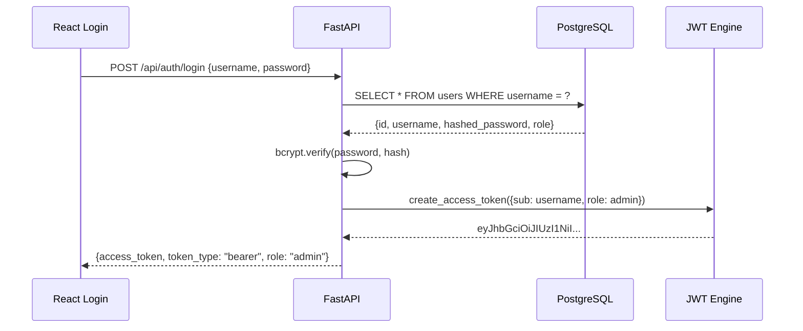

- **Password hashing:** bcrypt via `passlib`
- **JWT signing:** HS256, 24-hour expiry, secret from `JWT_SECRET_KEY` env var
- **Two middleware bouncers:**
  - `get_current_user` — validates JWT, extracts `{username, role}`
  - `require_admin` — calls `get_current_user` + rejects non-admin roles with HTTP 403

### Database Connection Pool

```python
# Startup: create pool of 2-10 persistent connections
_pg_pool = ThreadedConnectionPool(minconn=2, maxconn=10, **_PG_DSN)

# Per-request: borrow from pool, return on close
class _PooledConn:
    def close(self):
        _pg_pool.putconn(self._conn)  # Returns to pool, doesn't destroy
```

Every endpoint calls `get_pg_connection()` which borrows from the pool. The `_PooledConn` wrapper ensures `conn.close()` returns the connection instead of destroying it.

### Complete API Endpoint Map

#### 🔐 Authentication
| Method | Endpoint | Auth | Description |
|---|---|---|---|
| `POST` | `/api/auth/login` | — | Login with username/password → JWT token |
| `POST` | `/api/auth/register_operator` | Admin | Create new user account (admin or user) |

#### 📡 Real-Time
| Method | Endpoint | Auth | Description |
|---|---|---|---|
| `WS` | `/ws/live_alerts` | — | WebSocket — subscribes to Redis `live_face_alerts` pub/sub, pushes every detection to connected frontends |
| `GET` | `/api/stream/{cam_id}` | — | MJPEG streaming (legacy fallback) — pulls `latest_frame_{cam_id}` from Redis |

#### 📊 System
| Method | Endpoint | Auth | Description |
|---|---|---|---|
| `GET` | `/api/system/stats` | — | Dashboard stats: total faces, unique suspects, active cameras, start time |
| `GET` | `/api/system/status` | — | Returns `{is_armed: true/false}` from Redis |
| `POST` | `/api/system/toggle` | Admin | Arms/disarms the alert system (writes `system_armed` to Redis) |

#### 🔍 Investigation
| Method | Endpoint | Auth | Description |
|---|---|---|---|
| `POST` | `/api/investigate/search_by_image` | — | Upload photo → InsightFace embed → Milvus search (top 20) → join with PG sightings |
| `GET` | `/api/investigate/person/{person_id}` | — | Full timeline dossier: all sightings across cameras, chronological |

#### 👤 Subject Management (Watchlist)
| Method | Endpoint | Auth | Description |
|---|---|---|---|
| `GET` | `/api/subjects/list` | User | All subjects with categories, risk levels, image URLs |
| `POST` | `/api/subjects/enroll` | Admin | Upload face + metadata → InsightFace embed → Milvus `watchlist_faces` + PG `subjects` + `watchlist_members` |
| `PUT` | `/api/subjects/update/{uuid}` | Admin | Update metadata and optionally replace face image + re-embed |
| `DELETE` | `/api/subjects/remove/{uuid}` | Admin | Delete from Milvus + PG + disk |

#### 📋 Watchlist Categories
| Method | Endpoint | Auth | Description |
|---|---|---|---|
| `GET` | `/api/watchlist/categories` | User | List all categories (Blacklist, Most Wanted, etc.) |
| `POST` | `/api/watchlist/categories/add` | Admin | Create new category with name + color |
| `DELETE` | `/api/watchlist/categories/remove/{id}` | Admin | Delete category (CASCADE removes member links) |

#### ⚙️ Settings
| Method | Endpoint | Auth | Description |
|---|---|---|---|
| `GET` | `/api/settings/alerts` | — | Fetch threshold, sound type, email list, phone list |
| `POST` | `/api/settings/alerts` | — | Update all settings → syncs to both Redis (instant) + PG (persistent) |
| `POST` | `/api/settings/upload_audio` | — | Upload custom `.mp3/.wav/.ogg` alert sound |

#### 🎥 Camera Management
| Method | Endpoint | Auth | Description |
|---|---|---|---|
| `GET` | `/api/cameras` | — | List all cameras with RTSP URLs, FPS limits, active status |
| `POST` | `/api/cameras/add` | Admin | Enroll new camera (producer.py will auto-detect it within 5s) |
| `DELETE` | `/api/cameras/remove/{camera_id}` | Admin | Remove camera (producer.py will auto-stop thread within 5s) |

### Static File Mounts (Image Serving)

```python
app.mount("/images/watchlist", StaticFiles(directory="captured_faces/watchlist"))  # Enrollment photos
app.mount("/images/sightings", StaticFiles(directory="captured_faces/sightings"))  # Live captures
app.mount("/images",           StaticFiles(directory="captured_faces"))            # Fallback (P_xxx folders)
app.mount("/audio",            StaticFiles(directory="custom_audio"))              # Custom alert sounds
```

**Image path translation:** DB stores `/captured_faces/P_xxx/cam1_123.jpg` → API serves at `/images/P_xxx/cam1_123.jpg`

### Subject Enrollment Flow (Detailed)

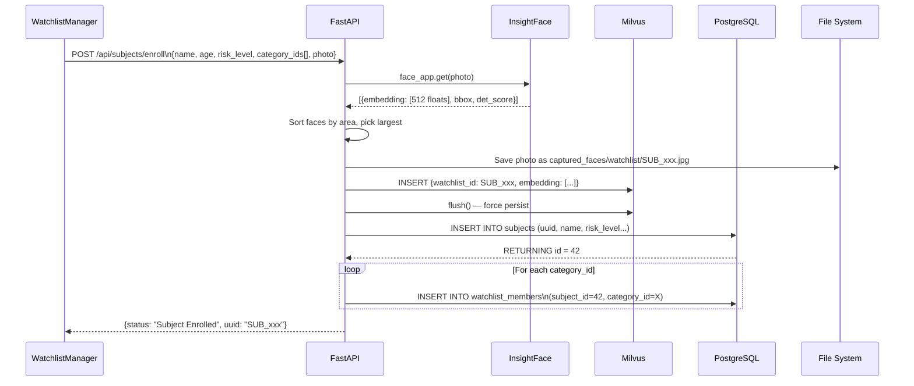

---

## 📧 Layer 6: Notification Microservice

**File:** [backend_api/worker_notify.py](file:///c:/Users/Hp/Desktop/video_intelligence_2/backend_api/worker_notify.py)

An independent Python process that listens for watchlist matches and sends email alerts.

```mermaid
flowchart TD
    A["Redis pubsub\nsubscribe live_face_alerts"] --> B{status ==\nWATCHLIST_MATCH?}
    B -->|NO| A
    B -->|YES| C{is_armed\n== true?}
    C -->|NO| D["🔕 Skip\n(System Disarmed)"]
    C -->|YES| E{email_sent_{person_id}\ncooldown active?}
    E -->|YES| F["🔕 Skip\n(5-min cooldown)"]
    E -->|NO| G["Fetch GLOBAL_NOTIFY_EMAILS\nfrom Redis"]
    G --> H["Send HTML email via\nGmail SMTP/TLS"]
    H --> I["Set email_sent_{person_id}\nTTL = 300s"]
```

**Email Features:**
- Dark-mode tactical HTML template with risk level badge
- 5-minute per-person cooldown prevents email flooding
- Credentials from environment variables (`SMTP_SENDER_EMAIL`, `SMTP_APP_PASSWORD`)
- Auto-reconnects to Redis if connection drops

---

## ⚛️ Layer 7: React Frontend

**Stack:** React (Vite 4.5), TailwindCSS, Lucide Icons, Inter font

### Application Structure

```
frontend/src/
├── main.jsx                    ← React DOM entry point
├── App.jsx                     ← Root: AuthProvider → BrowserRouter → Routes
├── config.js                   ← BACKEND_URL, WS_URL, MEDIAMTX_URL, getImageUrl()
├── api.js                      ← Axios instance with JWT Bearer interceptor
├── context/
│   └── AuthContext.jsx         ← React Context for auth state (token, user, login/logout)
├── pages/
│   ├── Login.jsx               ← Login form → POST /api/auth/login → store JWT
│   └── Dashboard.jsx           ← Main layout: Sidebar + View Router + WebSocket + Kill Switch
├── views/
│   ├── LiveMonitorView.jsx     ← 2×2 WebRTC camera grid + Live Intel Feed sidebar
│   ├── InvestigatorView.jsx    ← Image search + person timeline/dossier
│   ├── WatchlistManager.jsx    ← Subject enrollment, editing, categories, CRUD
│   ├── SystemStatusView.jsx    ← Auto-refreshing system stats
│   ├── EventFeedView.jsx       ← Terminal-style real-time log stream
│   ├── AlertSettingsView.jsx   ← Threshold slider, sound picker, email/phone config
│   ├── CameraSettingsView.jsx  ← Camera enrollment, RTSP config (Admin only)
│   └── AdminPanel.jsx          ← User management (Admin only)
└── components/
    ├── Sidebar.jsx             ← Left nav with C.O.R.E. branding, RBAC-aware items
    ├── ThreatAlertModal.jsx    ← Full-screen red modal for watchlist hits
    ├── EnrollSubjectModal.jsx  ← Multi-step enrollment form with categories
    ├── ManageCategoriesModal.jsx ← Category CRUD modal
    ├── WatchlistPanel.jsx      ← Inline subject grid with risk badges
    ├── LiveAlertBar.jsx        ← Top-of-screen red banner for active threats
    ├── SightingCard.jsx        ← Search result card: face, camera, score, time
    ├── TimelineCard.jsx        ← Chronological sighting entry for dossier
    ├── StatCard.jsx            ← Reusable dashboard stat widget
    └── ProtectedRoute.jsx      ← Route guard: redirects to /login if no JWT
```

### Global WebSocket Architecture

**File:** [Dashboard.jsx:90-165](file:///c:/Users/Hp/Desktop/video_intelligence_2/frontend/src/pages/Dashboard.jsx#L90-L165)

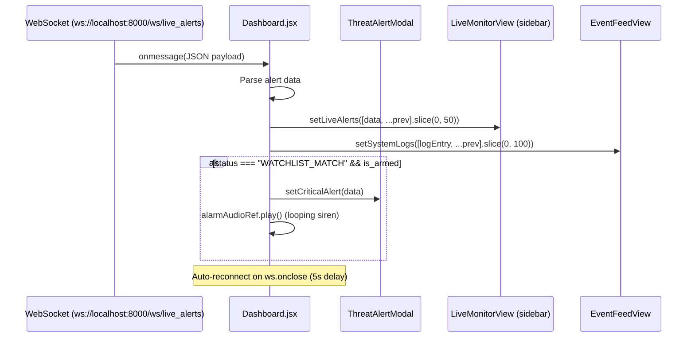

**Key Dashboard State:**
- `liveAlerts[]` — last 50 detections, passed to `LiveMonitorView`
- `systemLogs[]` — last 100 log entries, passed to `EventFeedView`
- `criticalAlert` — triggers `ThreatAlertModal` overlay
- `isArmed` — system arm/disarm toggle (Admin only)

### WebRTC Video Streaming

**File:** [LiveMonitorView.jsx:8-84](file:///c:/Users/Hp/Desktop/video_intelligence_2/frontend/src/views/LiveMonitorView.jsx#L8-L84)

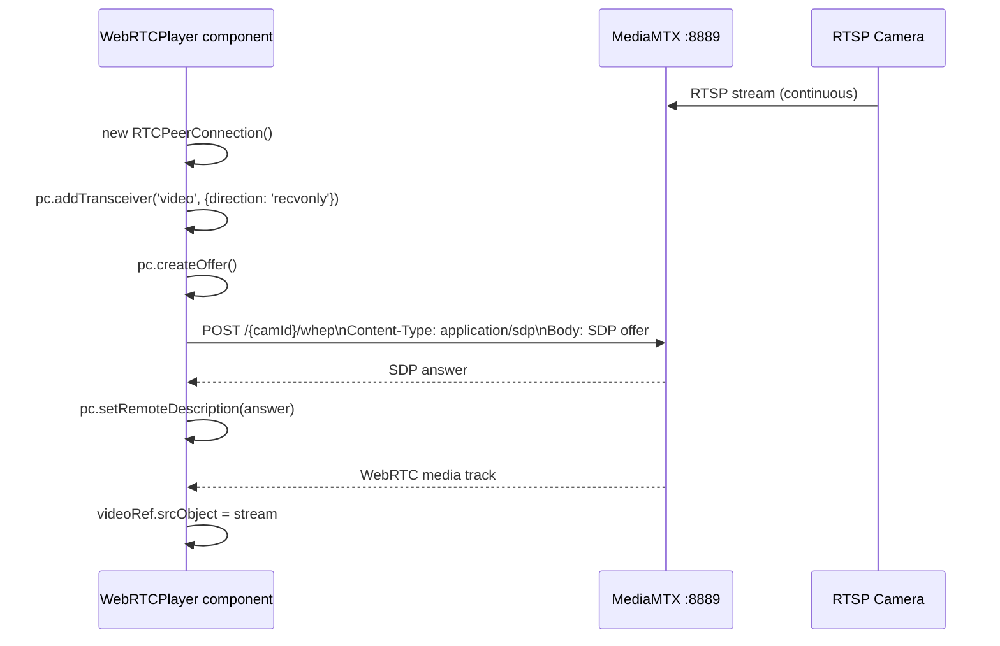

- **Protocol:** WHEP (WebRTC HTTP Egress Protocol)
- **Latency:** Sub-100ms (vs ~2-3s for MJPEG)
- **Auto-retry:** 3 attempts with 5s delay, then marks camera offline
- **Fullscreen:** Click any camera → fullscreen overlay, ESC to close

### RBAC-Aware Navigation

```javascript
// Base nav items (all users)
const baseNavItems = [
    'Live Monitor', 'Investigator', 'Watchlist',
    'System Status', 'Event Feed', 'Alert Settings'
];

// Admin-only additions
if (user.role === 'admin') {
    navItems.push('Camera Config', 'Admin Control');
}
```

### Authentication Flow

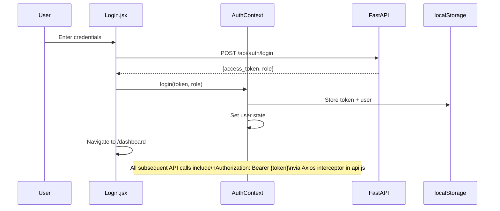

---

## 🔄 Complete Data Flow: End-to-End

### Flow A: New Person Detected (First Time)

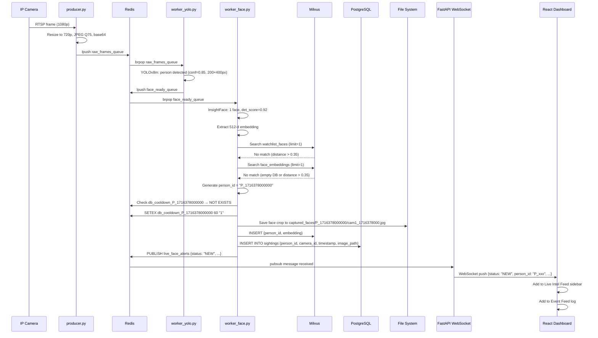

### Flow B: Watchlist Match (Armed System)

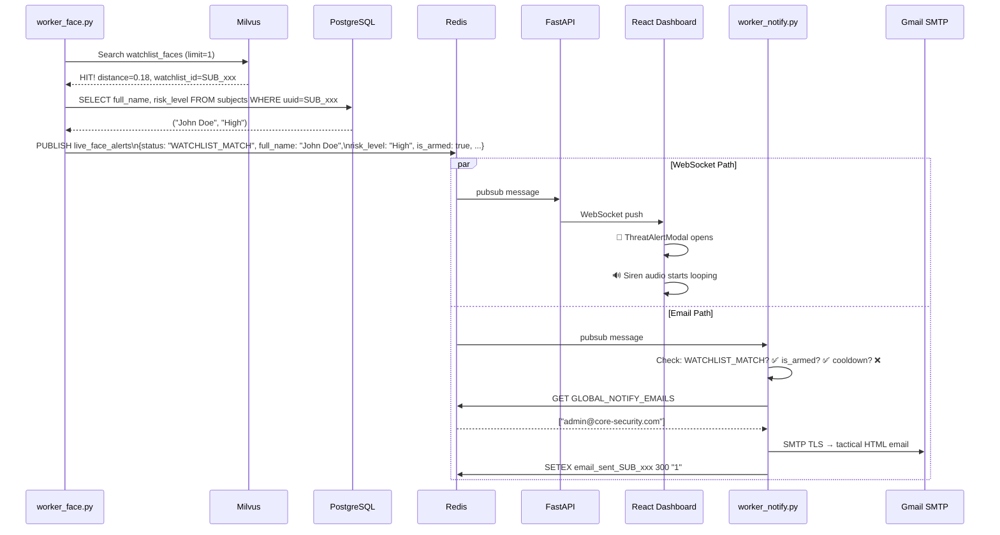

---

## 🔑 Redis Key Map

Redis serves as the central nervous system — queues, caches, pub/sub, and configuration store:

| Key/Channel | Type | Purpose | TTL |
|---|---|---|---|
| `raw_frames_queue` | List | Frame queue: producer → YOLO | capped at 1000 |
| `face_ready_queue` | List | Frame queue: YOLO → face worker | capped at 500 |
| `live_face_alerts` | Pub/Sub | Real-time detection alerts → API WS + email worker | — |
| `db_cooldown_{person_id}` | String | Prevents writing same person to DB repeatedly | 60s |
| `alert_cooldown_{person_id}` | String | Prevents WebSocket alert spam (only when Armed) | 60s |
| `email_sent_{person_id}` | String | Prevents email flooding for same person | 300s |
| `system_armed` | String | "1" = Armed, "0" = Disarmed | Persistent |
| `GLOBAL_MATCH_THRESHOLD` | String | Dynamic cosine distance threshold (UI slider) | Persistent |
| `GLOBAL_ALERT_SOUND` | String | "siren", "subtle", "silent", or "custom" | Persistent |
| `GLOBAL_NOTIFY_EMAILS` | String | JSON array of recipient emails | Persistent |
| `GLOBAL_NOTIFY_PHONES` | String | JSON array of phone numbers | Persistent |
| `GLOBAL_CUSTOM_AUDIO_URL` | String | Path to uploaded custom audio file | Persistent |
| `latest_frame_{cam_id}` | String | Latest base64 JPEG for MJPEG fallback | Overwritten |

---

## 🚀 Process Orchestration

**File:** [ecosystem.config.js](file:///c:/Users/Hp/Desktop/video_intelligence_2/ecosystem.config.js) — PM2 process manager

| Process | Script | Working Dir | Auto-Restart |
|---|---|---|---|
| `1-FastAPI-Backend` | `uvicorn newapi:app --host 0.0.0.0 --port 8000` | `backend_api/` | ✅ |
| `2-Camera-Ingestion` | `producer.py` | `Ingestion/` | ✅ |
| `3-Worker-YOLO` | `worker_yolo.py` | `ai_worker/` | ✅ |
| `4-Worker-Face` | `worker_face.py` | `ai_worker/` | ✅ |
| `5-React-Frontend` | `npm run dev` | `frontend/` | ✅ |

### Startup Sequence

```bash
# 1. Infrastructure (Docker)
docker-compose up -d

# 2. Initialize databases (FIRST TIME ONLY — creates tables + collections)
cd database_init && python init_db.py

# 3. Seed admin user (FIRST TIME ONLY)
cd backend_api && python seed_admin.py

# 4. Start all processes
pm2 start ecosystem.config.js
# OR manually:
cd backend_api   && uvicorn newapi:app --host 0.0.0.0 --port 8000 --reload
cd Ingestion     && python producer.py
cd ai_worker     && python worker_yolo.py
cd ai_worker     && python worker_face.py
cd frontend      && npm run dev
```

---

## 📁 Complete File Map

```
video_intelligence_2/
│
├── docker-compose.yml              ← 6 Docker containers
├── mediamtx.yml                    ← RTSP→WebRTC bridge config (4 cameras)
├── ecosystem.config.js             ← PM2 process manager (5 processes)
│
├── database_init/
│   └── init_db.py                  ← Creates 7 PG tables + 2 Milvus collections + seeds categories
│
├── Ingestion/
│   ├── producer.py                 ← Live RTSP → Redis (dynamic camera sync from DB)
│   └── producer_folder.py          ← Offline video files → Redis (batch mode)
│
├── ai_worker/
│   ├── worker_yolo.py              ← YOLOv8m person pre-filter
│   ├── worker_face.py              ← ★ PRODUCTION face worker (watchlist + general + dedup)
│   ├── facequalitygate_enhanced.py ← Quality-gated variant (night vision + blur/pose gates)
│   ├── optimized_face.py           ← Minimal batch-processing variant
│   └── yolov8m.pt                  ← YOLOv8 Medium weights (52MB)
│
├── tracker/                        ← EXPERIMENTAL ByteTrack pipeline (not in production)
│   ├── worker_yolo.py              ← YOLO + ByteTrack persistent tracking
│   ├── worker_face.py              ← Best-frame selection per track ID
│   ├── test_tracker.py             ← Visual debugging tool
│   └── yolov8m.pt                  ← Duplicate weights
│
├── backend_api/
│   ├── newapi.py                   ← ★ PRODUCTION FastAPI (978 lines, 20+ endpoints)
│   ├── auth.py                     ← JWT + RBAC middleware
│   ├── api.py                      ← Legacy API (superseded)
│   ├── seed_admin.py               ← One-time admin user creation
│   ├── worker_notify.py            ← Email notification microservice
│   └── ai_worker.py                ← Unused/legacy
│
├── frontend/
│   ├── package.json                ← React + Vite + TailwindCSS
│   ├── vite.config.js              ← Dev server config
│   └── src/
│       ├── App.jsx                 ← AuthProvider → ProtectedRoute → Dashboard
│       ├── config.js               ← Backend URLs + image path helper
│       ├── api.js                  ← Axios with JWT Bearer interceptor
│       ├── context/AuthContext.jsx  ← Auth state management
│       ├── pages/
│       │   ├── Login.jsx           ← Login form
│       │   └── Dashboard.jsx       ← Main layout + WebSocket + Kill Switch
│       ├── views/ (8 views)
│       └── components/ (10 components)
│
├── visual_testing/                 ← Benchmark suite (YOLO/InsightFace/Milvus perf tests)
├── ProjectPlan_v2.md               ← Original architecture design doc
├── notes.md                        ← Detailed project audit (1155 lines)
├── bug_report.md                   ← 23 tracked bugs with fixes
└── futurework.md                   ← Planned features
```

---

## 🔧 Key Design Decisions

| Decision | Rationale |
|---|---|
| **Redis as message queue** (not Kafka) | Simpler for 4-10 cameras. Kafka needed at 50+ cameras for partitioning and replay |
| **InsightFace antelopev2** (not separate RetinaFace + AdaFace) | Bundled model is simpler to deploy. Produces good 512-d embeddings out of the box |
| **Milvus IVF_FLAT** (not HNSW) | Lower memory footprint. Good enough recall at current scale (<100K faces) |
| **WebRTC via MediaMTX** (not MJPEG via Python) | Sub-100ms latency vs 2-3s. No Python involvement in video display path |
| **Dual Redis queues** (raw → YOLO → face) | Allows YOLO to be optional. Face worker can read from either queue |
| **Connection pool** (not per-request connections) | Prevents PG connection exhaustion under concurrent API load |
| **Dual cooldown system** (DB + Alert) | DB cooldown always prevents spam. Alert cooldown only active when Armed, so disarm→re-arm triggers immediately |
| **PM2 process manager** | Auto-restart on crash, log management, process monitoring |
| **JWT with RBAC** | Stateless auth with admin/user role separation for sensitive operations |
